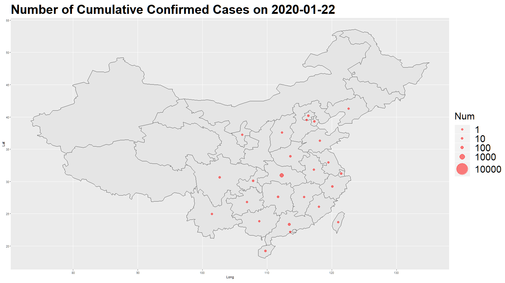
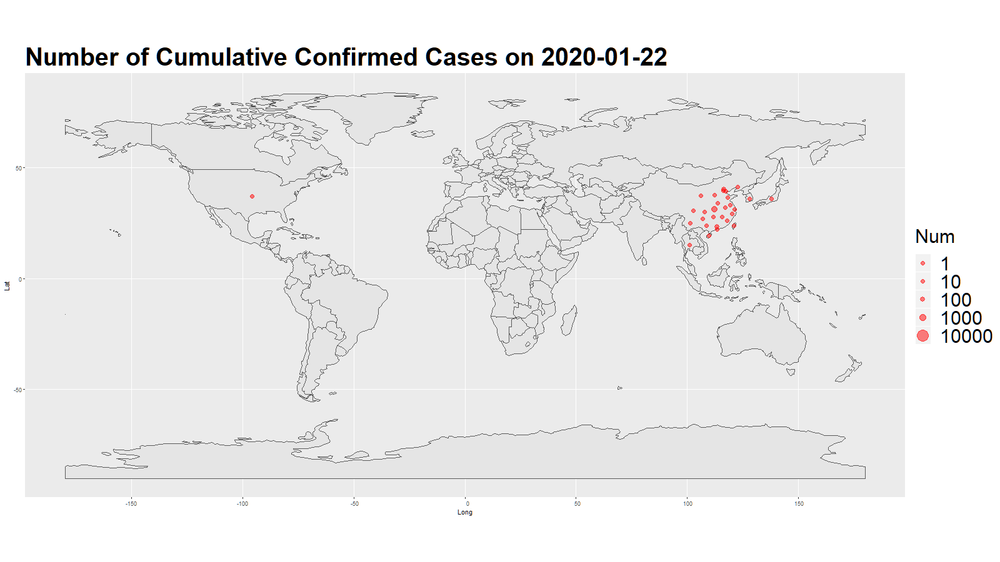
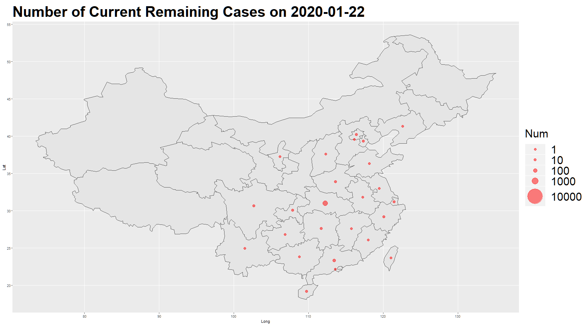
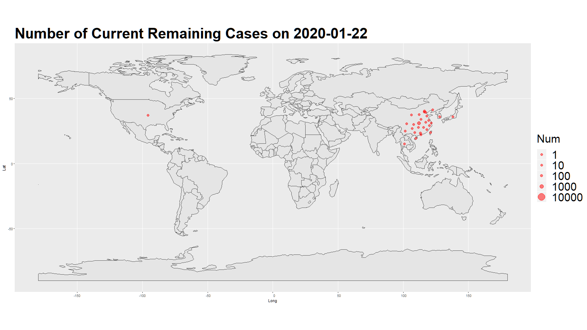

# COVID-19

Visualizing and modeling the COVID-19 is the main objective here. 

I'm trying to use R to implement this idea. The initial idea was to create an animated map with dots. I generalized the code in order to plot multi countries if we have the detailed location data of the cases. You can find my post [here](https://zhongjzsb.com/posts/baobao-posts/covid-19/). It includes some other types of plots, such ggplotly and shiny app.

Here are the plots for China, US and the entire world.

## Alternative plot

I come into this [github](https://github.com/globalcitizen/2019-wuhan-coronavirus-data/) and created similar plot in R.

## Todo:

1. [ ] Modelling the data with SIR.
2. [ ] Shiny app update.

## Acknowledgement

The data source is from [JHU CSSE](https://github.com/CSSEGISandData/COVID-19) (Old website is [JHU nCov](https://systems.jhu.edu/research/public-health/ncov/)).

## References:
- [JHU CSSE](https://systems.jhu.edu/research/public-health/ncov/)
- [2019-wuhan-ncov](https://github.com/globalcitizen/2019-wuhan-coronavirus-data/)
- [some blog](http://boazsobrado.com/blog/2019/01/13/where-i-was-in-2018/)
- [changing-ggplot-geom-sf-choropleth-fill-color](https://stackoverflow.com/questions/48288183/changing-ggplot-geom-sf-choropleth-fill-colors)
- [ggplot2-sf](https://www.r-spatial.org/r/2018/10/25/ggplot2-sf.html)
- [cn-cities](https://simplemaps.com/data/cn-cities)
- [convert-some-column-classes-in-data-table](https://stackoverflow.com/questions/32940580/convert-some-column-classes-in-data-table)

## Licence

<a href="https://creativecommons.org/licenses/by-nc/4.0/" target="_blank" rel="noopener">CC BY-NC 4.0</a>